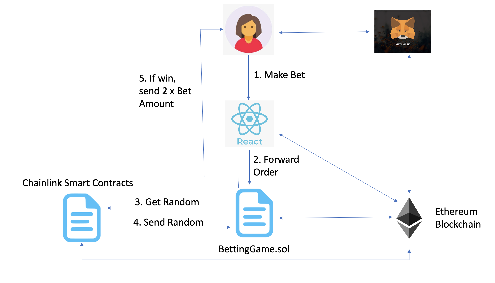

# BettingGame_with_Chainlink_VRF
A Decentralized Betting Game using Chainlink's Randomness.

# Project Diagram

# Tools needed:
1. Truffle box for Local DAPP Developemnt: https://github.com/truffle-box/react-box
2. Metamask for Deploying it in Test networks:  https://metamask.io/

# Resources :
1. ChainLink's VRF function to generate Random number : https://blog.chain.link/random-number-generation-solidity/

# Installation
1. npm install -g truffle ---> Truffle intsallation
2. truffle unbox react    ---> Unbox the React box

## How to execute the DAPP?
1. Run the React Application using "npm run start", this will start our React application in localhost:3000
2. We will be provided with an option to chose either low(representing 1,2,3 in the dice) or high(representing 4,5,6 in the dice) and bet amount to be supplied as input.
3. Since we are using rinkeby test network to deploy the application ("truffle migrate --network rinkeby_infura --reset"), we need some ETH in that network. 
4. We also need LINK for generating the random number by chainlink's VRF function.
5. We need to supply the ETH and LINK to the Smart Contracts Address (we get this by deploying the application) for performing betting.
6. Once we bet, according to the random number that gets generated, Match is performed between the generated random number and supplied low or high values.
7. If the match is successful, The player gets twice the amount that he bet. Otherwise, he loses the game.
